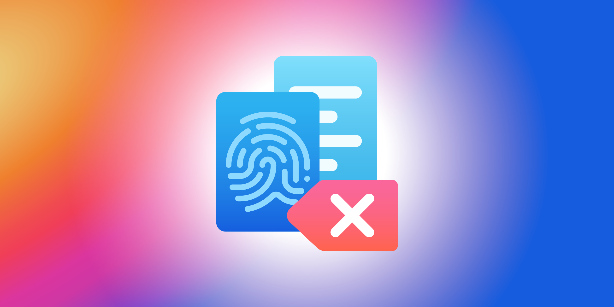

# Introduction

Secure-rm is composed of two parts: a [Node.js module](core/installation.md) with a straightforward API and a command line interface optimized to delete files on the fly.

When you delete a file using the `rm` UNIX command or `fs.unlink` in node, it only removes direct pointers to the data disk sectors and make the data recovery possible with common software tools.

Permanent data erasure goes beyond basic file deletion commands, which:

1. Allow for selection of a specific standard, based on unique needs,
2. Verify the overwriting method has been successful and removed data across the entire device.

## How It Works

The basic principle is to write files before deletion in order to make recovery harder. With secure-rm, you get to choose the standard that follow your needs. Each one is composed of instructions about how many passes it should perform.

It goes from a simple pass of zeros to a 35 passes algorithm. Secure-rm comes with its own algorithm to ensure your data is safe:

* A pass of cryptographically strong pseudo-random data,
* The file is then renamed,
* And finally truncated to hide the file size.

## Features

**With each tool**

* [Choose your standard](core/standards.md)

**Core library**

* [Create your own standard](core/custom-standard/)
  * [using files method](core/custom-standard/unlink-methods.md)
  * [or directories ones](core/custom-standard/rmdir-methods.md)
* Use options to configure the behavior
* [Use events to follow the progression with huge files](core/events.md)

## Getting Secure-rm


 The `secure-rm` module does not come with the CLI, you have to install it separately.


