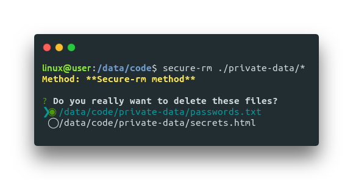
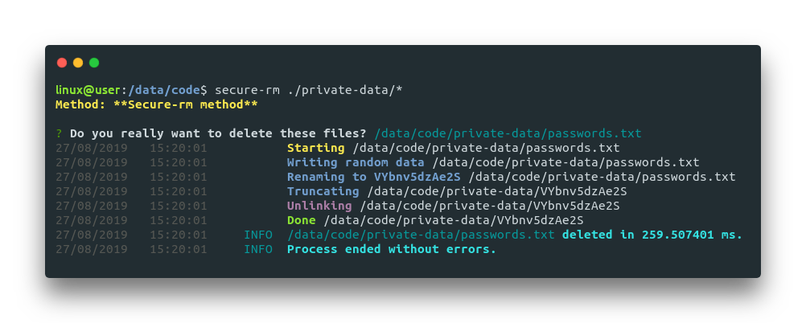
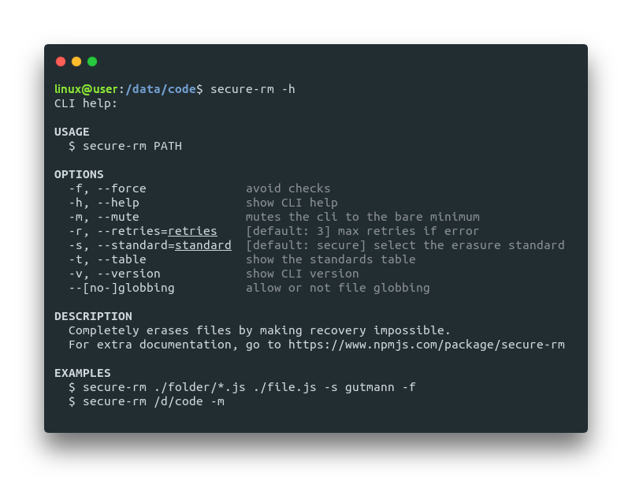

# Getting Started

## 📦 Global Installation

The CLI can be accessed anywhere if installed globally:



```bash
$ yarn global add secure-rm-cli
```



```
$ npm install secure-rm-cli -g
```



If you only want to have it in a project, you can install it locally:



```bash
$ yarn add secure-rm-cli
```



```
$ npm install secure-rm-cli
```



## 🚀 Quick Start

```bash
$ secure-rm ./your-folder/*.js
```

Path can be a directory, a file or a [glob pattern](https://www.npmjs.com/package/glob). Match files using the patterns the shell uses, like stars and stuff.

When you submit files, secure-rm ensures if you really want to delete the files:



And then you get a complete log of what happened:



## 📚 Usage

```text
secure-rm <PATHS> [OPTIONS]
```

* `PATHS`:
  * one or multiple paths \(e.g. `D:\data /d/data ./data/file.js ../../data`\)
  * supports [glob patterns](https://www.npmjs.com/package/glob#glob-primer) \(e.g. `./*.js ./**/* @(pattern|pat*|pat?erN)`\)
* `OPTIONS` \(flags\):
  * `-f, --force`: avoid checks if you want to use it in a shell or bash file;
  * `-h, --help`: show CLI help, see below;
  * `-m, --mute`: mutes the cli to the bare minimum, just the end messages;
  * `-s, --standard`: text ID of the standard, default is `secure`. See them detailed below;
  * `-r, --retries`: max retries if an error occur;
  * `-t, --table`: show the standards table. See them detailed below;
  * `-v, --version`: show CLI version;
  * `--no-globbing`: disable file globbing.

Example:

```text
secure-rm ./folder/*.js ./file.js -s gutmann -f
```

You can invoke the built-in help with `secure-rm -h`:



Check the different standards here:



